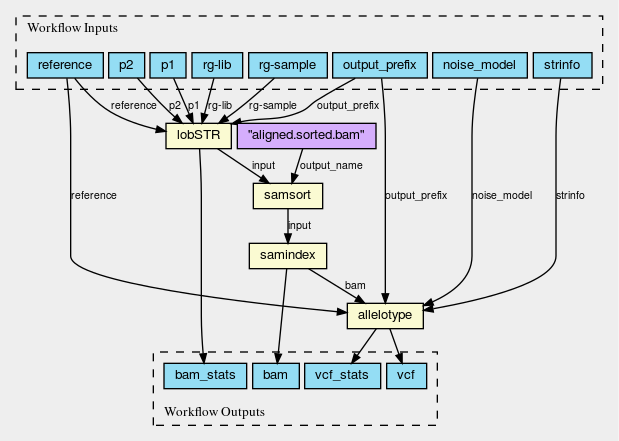
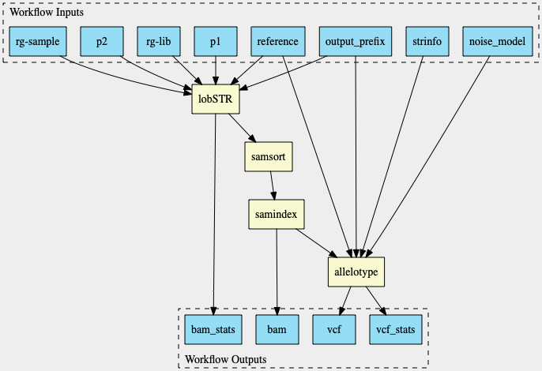

# Examples

example based on:

[https://view.commonwl.org/workflows/github.com/common-workflow-language/workflows/blob/17b65ea19d81527090fded62ffa0e1ba3b25d561/workflows/lobSTR/lobSTR-workflow.cwl](Workflow: lobSTR-workflow.cwl)

CWLViewer

PyCWLViewer
